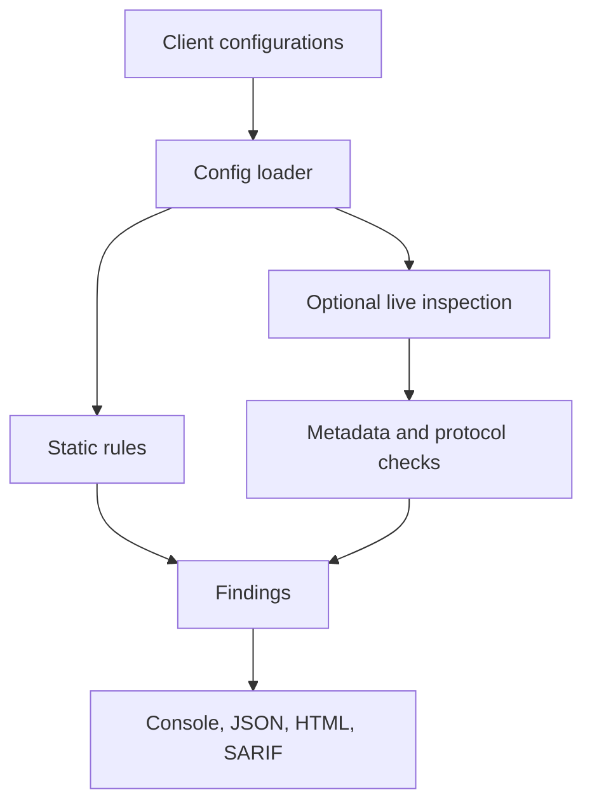

# Architecture

The stdio runtime guard is a separate execution path between the MCP client and
server. Its policy decisions feed local audit logs and optional OTLP exporters.
See [known boundaries](LIMITATIONS.md) and [the roadmap](ROADMAP.md).

## Modules

| Module | Responsibility |
|---|---|
| `config/loader.py` | Parses `mcpServers`, `servers` (VS Code), `context_servers` (Zed), `[mcp_servers.*]` (Codex TOML), `~/.claude.json` projects; JSONC tolerant. Normalises to `ServerSpec`. |
| `config/locations.py` | Known user/project config paths per OS (shadow-MCP discovery). |
| `checks/registry.py` | Single source of truth for every rule: ID, severity, OWASP MCP/ASI, CWE, remediation, references. |
| `checks/config_checks.py` | Static rules: secrets, transport, launch commands, containers, supply chain, filesystem scope, agent settings, allowlists. |
| `checks/packages.py` | Extracts npm/PyPI/Docker/URL packages from `npx`, `bunx`, `pnpm dlx`, `uvx`, `pipx`, `docker run` (incl. inside `sh -c`), matches `data/advisories.json`, typosquats and known-malicious packages. |
| `checks/text.py` | Detection primitives: Unicode-tag smuggling (decoded), zero-width/bidi/ANSI, injection language families, base64 payloads, secret formats. |
| `checks/tool_checks.py` | Live rules over tool definitions, full input/output schemas, server instructions, prompts, resources; cross-server shadowing/collisions; capability-based toxic-flow analysis. |
| `live/client.py` | Minimal JSON-RPC client. Transports: stdio, Streamable HTTP (JSON + SSE responses), legacy HTTP+SSE. Eras: modern (2026-07-28) and legacy (`initialize`). |
| `live/probes.py` | Read-only HTTP probes (auth, Origin, CORS, TLS, RFC 9728/8414 metadata, PKCE, RFC 9207, session IDs, verbose errors). |
| `pinning.py` | Canonical SHA-256 digests of tool definitions; lock file build/verify. |
| `proxy/` | Runtime guard and YAML policy. |
| `auditlog.py` | JSONL, SHA-256 hash chain, optional HMAC-SHA256 (`MCPSHIELD_AUDIT_KEY`). |

## MCP 2026-07-28 support

The 2026-07-28 revision made MCP stateless. MCPShield implements the version-negotiation rules for dual-era clients:

1. **stdio** – send `server/discover` with modern `_meta`
   (`io.modelcontextprotocol/protocolVersion`, `clientInfo`, `clientCapabilities`).
   A `DiscoverResult` or a modern error (`-32022 UnsupportedProtocolVersion`, `-32021`, `-32020`) ⇒ modern server;
   anything else, a timeout or process exit ⇒ restart if needed and fall back to `initialize`.
2. **Streamable HTTP** – POST a modern request with `MCP-Protocol-Version`, `Mcp-Method` (and `Mcp-Name`) headers; a
   non-modern `4xx` body ⇒ fall back to `initialize` (+ `Mcp-Session-Id` handling for legacy sessions).
3. **HTTP+SSE** (2024-11-05, now Deprecated) – GET stream + `endpoint` event.

The fixtures support Python SDK v1 and v2 APIs, plus a dependency-free protocol
fixture. This review ran the full suite with SDK 2.3.0 on Linux/Python 3.12.
Hosted CI and the dedicated legacy SDK job must pass before publishing; local
fixture success does not establish compatibility with every MCP client.

Spec-driven checks added for this revision: `x-mcp-header` validation (MCPS-TOOL-011), deprecated Sampling/Roots/Logging
(MCPS-CAP-001), legacy-only servers (MCPS-CAP-002), deprecated SSE transport (MCPS-TRN-002), RFC 9207 `iss` support
(MCPS-HTTP-011), and legacy session-ID quality (MCPS-HTTP-008).

## Severity & scoring

Each rule has a default severity; checks may raise or lower it with evidence (e.g. a recognised token format makes a
hardcoded secret critical; a config-inferred toxic combination is medium until confirmed live). The risk score is
driven by the worst finding (critical ⇒ ≥75) with diminishing returns for volume, mapped to grades A–F.

## Detection accuracy

The supplied tests include benign and poisoned fixtures. A representative,
versioned external accuracy benchmark has not been reproduced in this review.
Earlier numeric false-positive claims are withdrawn pending published inputs,
versions and results. See the feedback plan and roadmap for that work.
